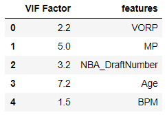
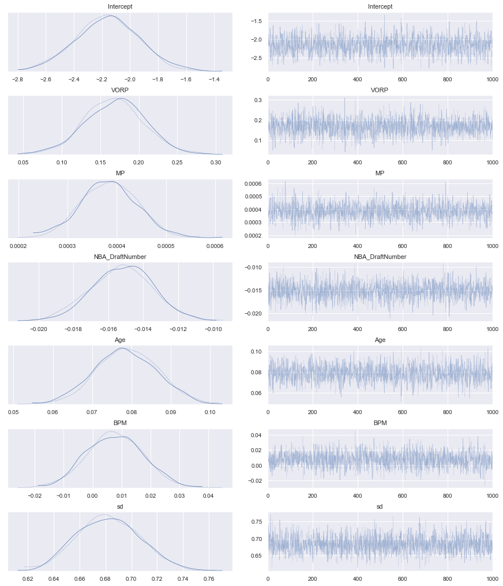
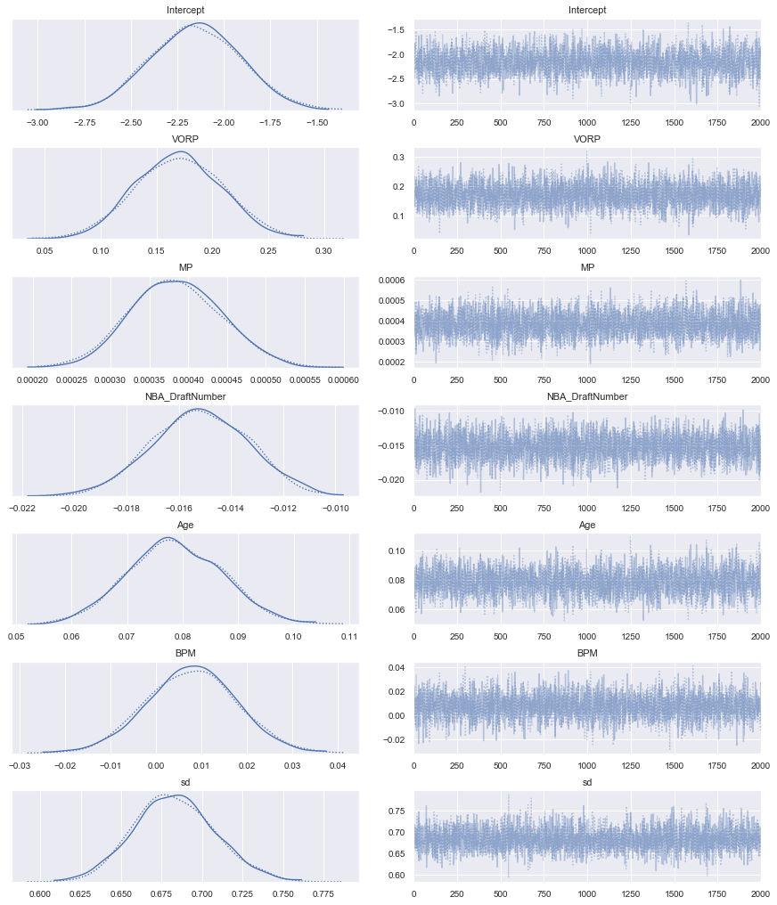
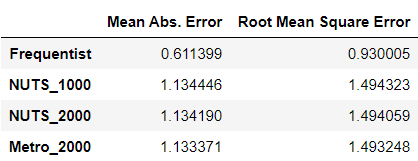

# Predicting NBA Players Salaries with Bayesian Linear Regression

## Project Goals
* Get hands on experience with Markov Chain Monte Carlo methods
* Understand the difference between Bayesian Approach vs. Frequentist Approach
* Test on No U-Turns Sampler (NUTS) method (Hamiltonian Monte Carlo method)

## Results
* Selected features

* The trace plot and the posterior distributions of parametersof the model with 1000 samples for illustration purpose

* Evaludation Scores

## Abstract
As one of the most famous and useful statistical models, linear regression has been studied by
researchers from every possible angle. Among the various perspectives that people look at the
linear regression problem, two genres stand out and have been "competed" for decades, which
are Bayesian and Frequentist. In this project, I aim to build a linear regression model to predict
NBA players' salaries from both the Bayesian approach and the Frequentist approach. To be more
specific, I want to study the difference between the two approaches in terms of the result and the
interpretations of the parameters. In the next section, I am going to give a brief introduction to
the data I collected for this project and the data preprocessing I have done.

[Coding details](https://github.com/Derolik666/Bayesian_Stats_Project/blob/master/Bayesian%20Project.ipynb) and 
[project report](https://github.com/Derolik666/Bayesian_Stats_Project/blob/master/6420_Project.pdf) can be accessed here
